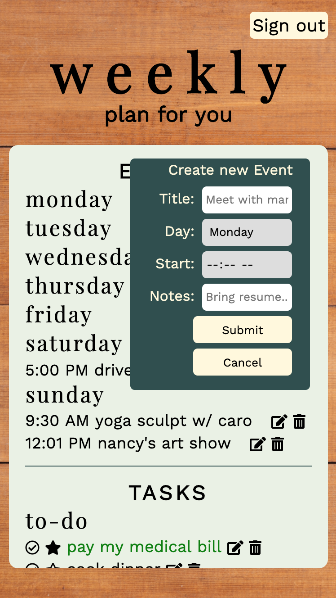

# Weekly: Plan for you

## Overview

Weekly is an full-stack application where users can create an account, log in, and access an interactive planner that tracks your events for the next week and any tasks you need to accomplish. Users can add new events, edit existing events, and remove existing events. The same actions can be done for tasks. Important tasks that you must accomplish can be made a priority.

Click [here](https://ancient-badlands-64634.herokuapp.com/) to try for yourself.

**Language:** Javascript  
**Technologies Used:** Node.js, Express, MongoDB / Mongoose, Passport, jQuery, HTML/CSS

## API Endpoints

### POST /signup

Create a new user

### POST /login

Log in to the application

### GET /planner/events and GET /planner/tasks

   
Display events and tasks

### POST /planner/events

   
Create new events

### POST /planner/tasks

   
Create new tasks

### PUT /planner/events/:id

  
Edit an existing event

### PUT /planner/tasks/id

Edit an existing task

### DELETE /planner/events/:id and DELETE /planner/events/:id

Delete an existing task or event
